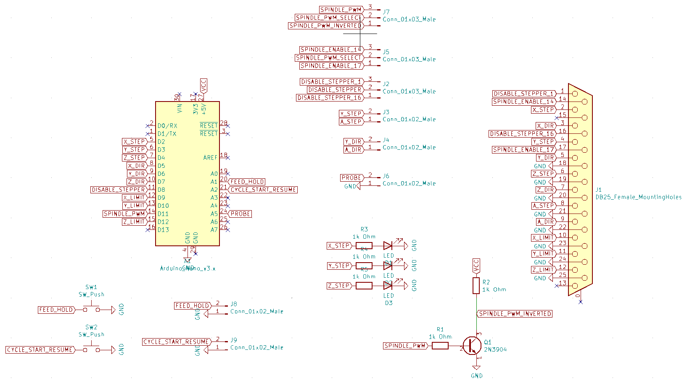
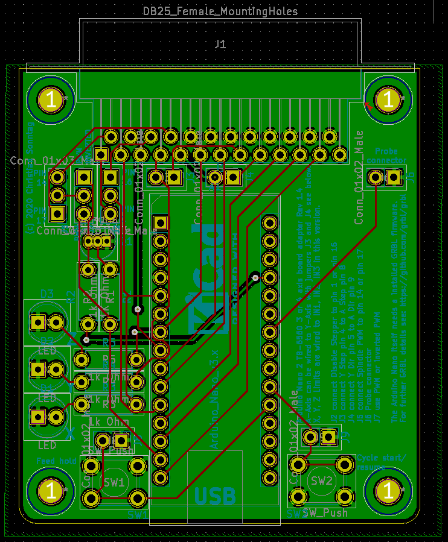

# Arduino nano to parallel TB6560 cnc driver board adapter

This is my little Arduino nano to parallel TB6560 cnc driver board project. Started some time
ago using a red TB6560 4-axis board (before that i had an green 3-axis TB6560). 
At the moment the TB6560 alu case version is my preferred choice 
(but over time i can not remember why the red board was annoying me).
The adapter should also work with 3-axis TB6560 boards if the Pinout is the same.

* [KiCad](https://kicad-pcb.org/) files are included if you have special needs.
* Gerber files are included if you want to order your own pcb for e.g. at [jlcpsb.com](https://jlcpcb.com/)
* STL file of simple mount plate made with OpenSCAD is included if you have a 3d printer

Just work in progress current revision 1.3 using GRBL 1.1h (photos of Rev 1.3 will follow).


## KiCad schema



## KiCad pcb wiring



## KiCad pcb 3d preview


## Simple mount in OpenSCAD


## Pins

Arduino nano | GRBL 1.1 | DB25 red pcb | DB25 alu case version
---|---|---|---
D8 | Disable Stepper | 1 | 16
D2 | X Step | 2 | 2
D3 | Y Step | 4 (+8 A Step) | 4 (+8 A Step)
D4 | Z Step | 6 | 6
D5 | X Dir | 3 | 3
D6 | Y Dir | 5 (+9 A Dir) | 5 (+9 A Dir)
D7 | Z Dir | 7 | 7
D9 | X Limit | 10 (IN1) | 10 (IN1)
D10 | Y Limit | 11 (IN2) | 11 (IN2)
D11 | Spindle Enable | 14 | 17 (see PWM invert!)
D12 | Z Limit | 12 (IN3) | 12 (IN3)
D13 | Spindle Dir | 	 | 
A0 | Reset/Abort | 	 | 
A1 | Feed/Hold | 	 | 
A2 | Cycle Start/Resume | 	 | 
A3 | Cooling Enable | 	 | 
GND | GND | 18-25 | 18-25

## Jumper on board

There are some jumpers to configure the board for the two used 4-axis board versions.

Jumper | Description
---|---
J2 | connect Disable Stepper to pin 1* or pin 16** 
J3 | connect Y Step pin 4* to A Step pin 8**
J4 | connect Y Dir pin 5* to A Dir pin 9**
J5 | connect Spindle PWM to pin 14* or pin 17**
J6 | Probe connector
J7 | use PWM, inverted PWM or disable
J8 | connector for alternative feed hold button
J9 | connector for alternative cycle start/resume button

*red board version / **alu case version

## PWM invert

TB6560 boards use low as spindle enable and high as spindel disable (WTF!?). It is the opposite way of how GRBL handle spindle enable/PWM.
The used invert circuit will fix this. But there is a little gap where the invert is not active during startup/shutdown.
> !!! As a workaround for now -> power on arduino at first and power off at last again to prevent injury through spindle.


Sources: 
* [How to setup inverting PWM signal and using +5v to switch off spindle motor? · Issue #22 · gnea/grbl · GitHub](https://github.com/gnea/grbl/issues/22)
* [GRBL PWM inverter circuit](https://blog.eccentricworkshop.com/grbl-pwm-inverter-circuit/)
* [Explain the Logic NOT Gate or Inverter and its Operation with Truth Table](https://electronicspost.com/explain-the-logic-not-gate-or-inverter-and-its-operation-with-truth-table/)

## My current GRBL settings

```
$$
$0=10
$1=25
$2=0
$3=5
$4=0
$5=0
$6=0
$10=1
$11=0.010
$12=0.002
$13=0
$20=0
$21=0
$22=0
$23=0
$24=25.000
$25=500.000
$26=250
$27=1.000
$30=1000
$31=0
$32=0
$100=402.000
$101=402.000
$102=402.000
$110=1500.000
$111=1500.000
$112=750.000
$120=42.000
$121=42.000
$122=42.000
$130=2000.000
$131=2000.000
$132=2000.000
```

## Probe G Codes

```
G38.2 z-10 f1
```
http://www.linuxcnc.org/docs/2.6/html/gcode/gcode.html#sec:G38-probe
```
G92 z19.2
```
http://www.linuxcnc.org/docs/2.6/html/gcode/gcode.html#sec:G92

## Compiling GRBL

Download, extract and copy GRBL to the Arduino library. More details see here: https://github.com/gnea/grbl/wiki/Compiling-Grbl

Arduino IDE settings:
* Tools -> Board -> "Arduino Nano"
* Tools -> Processor -> "ATmega328P (Old Bootloader)"
* Tools -> Port -> "/dev/ttyUSB0" (may vary)
* Tools -> Programer -> "Atmel-ICE(AVR)"

## Arduino nano pinout

GRBL PWM enabled | GRBL
---|---
 | 

### Only for comparison GRBL on STM32F103C8T6 (bluepill)

Just for info. Interesting board with much faster cpu and more memory.  https://github.com/usbcnc/grbl


## other Source
* [Des Fricklers Fräse](https://der-frickler.net/technik/frickelfraese)
* [Make: China-Schrittmotorsteuerung](https://www.heise.de/make/artikel/3-Achs-Schrittmotorsteuerung-aus-China-1518901.html)
* [Grbl CNC USB to TB6560 Interface using Arduino](https://www.coreforge.com/blog/2014/08/grbl-tb6560-interface/)
* [G25 CNC Shield ](http://kclinear.com/G25/Instructions.pdf)
